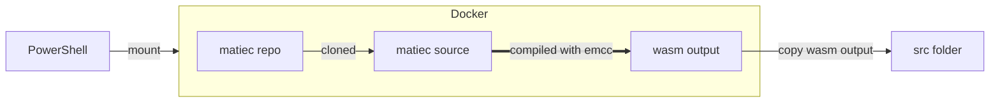
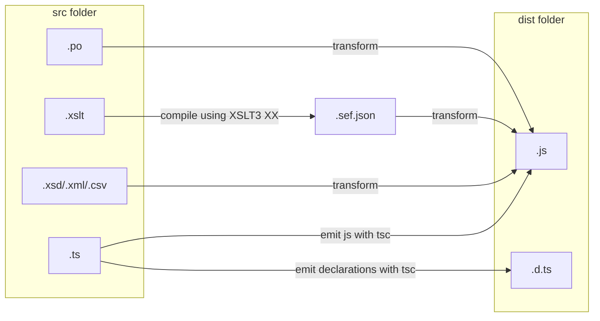

# Beremiz POC

List of doable things that could be implemented later for a vscode/theia version of Beremiz.

This repo has two main goals:
- Find a way to build beremiz core mechanics in js.
- Make sure these features are isomorphic and can work in both browser & Node.Js.

| Feature                             | Browser | Node.Js |
|-------------------------------------|---------|---------|
| [Xslt processor](#Saxon)            | ✔️      | ✔️      |
| [Xslt js function callback](#Saxon) | ✔️      | ✔️      |
| [Xslt dom access](#Saxon)           | ✔️      | ❌       |
| [XPath](#Saxon)                     | ✔️      | ✔️      |
| [Xsd validation](#XSD)              | ✔️      | ✔️      |
| [Matiec WASM](#Matiec)              | ✔️      | ✔️      |
| [gettext](#gettext)                 | ✔️      | ✔️      |

This repository is a [pnpm workspace](https://pnpm.io/workspaces). Make sure you have pnpm and Node.js 18+ installed.

It contains 3 packages:
- core: Xml/Xslt/Xsd implementations.
- matiec: WASM toolchain to compile & run matiec as a WASM module using [emscripten](https://emscripten.org/index.html).
- matiec-demo: A demo of matiec using nuxt & monaco editor in browser. [DEMO](https://3c427fed.matiec-bolt.pages.dev/)

There is currently no build system such as [lerna](https://github.com/lerna/lerna) to have global build/test scripts.

To run tests or build, clone or fork this repo and then:
```sh
cd packages/[package]
pnpm run test or build
```

To build matiec demo SPA, use generate
```sh
cd packages/matiec-demo
pnpm run generate
```

> [!NOTE]
> The matiec package has a DockerFile which clones matiec repository and runs the [emcc](https://emscripten.org/docs/tools_reference/emcc.html) compiler.
>
> Running docker won't be enough as we need to copy the output inside the src folder.
>
> The matiec-2-wasm Powershell file is here to run all this process automatically.
> See [matiec](#matiec) for more.

# Saxon

## Usage of saxon

Saxonica provides the [saxon-js](https://www.npmjs.com/package/saxon-js) package to overcome built-in Xslt browser limitations.

The library can also [support evaluations](https://www.saxonica.com/saxon-js/documentation2/index.html#!development/global) of js functions.
The [globalThis](https://developer.mozilla.org/en-US/docs/Web/JavaScript/Reference/Global_Objects/globalThis) object is available in all environments, so i declared all xslt functions as keys of globalThis.

Moreover, Typescript can be easily extended using module declarations.

```typescript
declare module globalThis {
    function ConfigTagName(_name: SaxonNode): void
    function ResourceTagName(_ancestor: SaxonNode, _name: SaxonNode): void
}
```

**You can see how all beremiz collectors are implemented in core/plcopen/collectors**

## DOM

DOM access should not be a problem since saxon has access to global context.
However, it is impossible to access DOM on Node.js for obvious reasons.

## XPath

XPath with saxon is different from lxml, for example, the following code from **plcopen.py**:

```python
def getpous(self, exclude=None, filter=None):
    filter = [] if filter is None else filter
    return self.xpath(
        "ppx:types/ppx:pous/ppx:pou%s%s" %
        (("[@name!='%s']" % exclude) if exclude is not None else '',
         ("[%s]" % " or ".join(
             ["@pouType='%s'" % x for x in filter]))
         if len(filter) > 0 else ""),
        namespaces=PLCOpenParser.NSMAP)
```

Would be like this with saxon:

```typescript
const getPous = (exclude?: string, filter: string[] = []) => {
    let clause1 = exclude !== null ? `[@name!='${exclude}']` : '';
    let clause2 = filter.length > 0
        ? `[${filter.map(x => `@pouType='${x}'`).join(' or ')}]`
        : '';

    return saxon.XPath.evaluate(`//ppx:types/ppx:pous/ppx:pou${clause1}${clause2}`, this._beremizFile, { ...ns, resultForm: "array" })
        .map(x => ({
            getName: saxon.XPath.evaluate('@name', x, ns).value,
            getPouType: saxon.XPath.evaluate('@pouType', x, ns).value,
            getBodyType: saxon.XPath.evaluate('local-name(./body/*[1])', x, ns)
        }))
}
```

Because we can't have direct access to the attributes the same way as lxml, we return a list of getters for each POU the first evaluate function could find.

# XSD

While we can leverage a lot from saxon-js, [It can't validate xsd schemas](https://stackoverflow.com/a/63336588).

But recently someone decided to make a port of [libxml2 to wasm using emscripten](https://github.com/jameslan/libxml2-wasm).

So TC6 validation is available.

# Matiec

Matiec can be compiled to WebAssembly with emcc.

The output is a single ES6 module thanks to --SINGLE-FILE parameter, and the wasm binary is stored inside the js file.

> [!NOTE]
> Both iec2c & iec2iec executables are generated, but I could not find a usage of iec2iec executable in Beremiz source code, so only iec2c is bundled.

This is how the PowerShell scripts compile matiec:



# Bundler

I've decided to choose [esbuild](https://esbuild.github.io/) as it became my weapon of choice for web libraries over the last years.

This is purely opinion-based and can be changed to webpack or rollup depending on future needs.

Since saxon-js needs XSLT files to be converted to SEF (stylesheet export file) first, the bundler will also compile all XSLT files to *.sef.json.



Both .js & .d.ts are emitted for typescript, so non-ts user can use the package in a pure javascript project.

This configuration allows us to import all non-js files directly in js, esbuild will take care of the rest.

# gettext

Support for gettext is available thanks to [gettext.js](https://github.com/guillaumepotier/gettext.js)

gettext is available as a global singleton and locales can be loaded automatically.

> [!WARNING]
> gettext.js does not seem to support "%s" & "%a1" placeholders. 
> Therefore, all placeholders have been converted to numeric ones.
> The original .po files remain unchanged, everything is done during the build process. 

# Front end frameworks

Most front end frameworks heavily use JSON for their template and reactivity system.

At first, you might be thinking a painful conversion between XML -> JSON and then JSON -> XML is the only way.

But some frameworks allow the developers to override their reactivity systems such as [vue customRef](https://vuejs.org/api/reactivity-advanced.html).

An implementation of customRef could be like this:

```typescript
import { customRef } from 'vue'

export function getPous(XpathGet, XPathSet) {
    return customRef((track, trigger) => {
        return {
            get() {
                // Do some XPATH stuff here to get a value ...
                track()
                return value
            },
            set(newValue) {
                // Do some XPATH stuff here to change a value ...
                trigger()
            }
        }
    })
}
```

Then we can use getPous and have reactive objects compatible with templates.

```vue
<script setup>
  import { getPous } from './plc'
  const allPous = getPous(XpathGet, XpathSet)
</script>

<template>
  <span>{{ allPous }}</span>
</template>
```